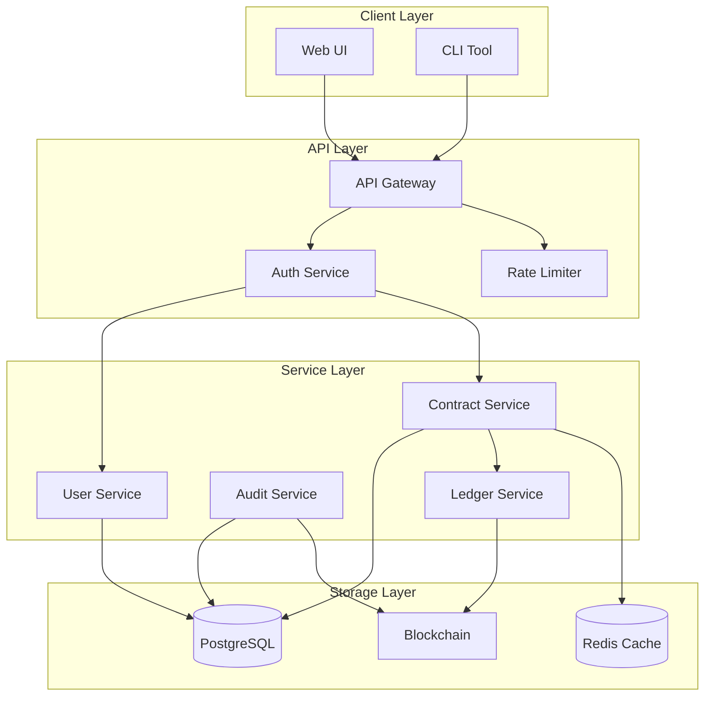
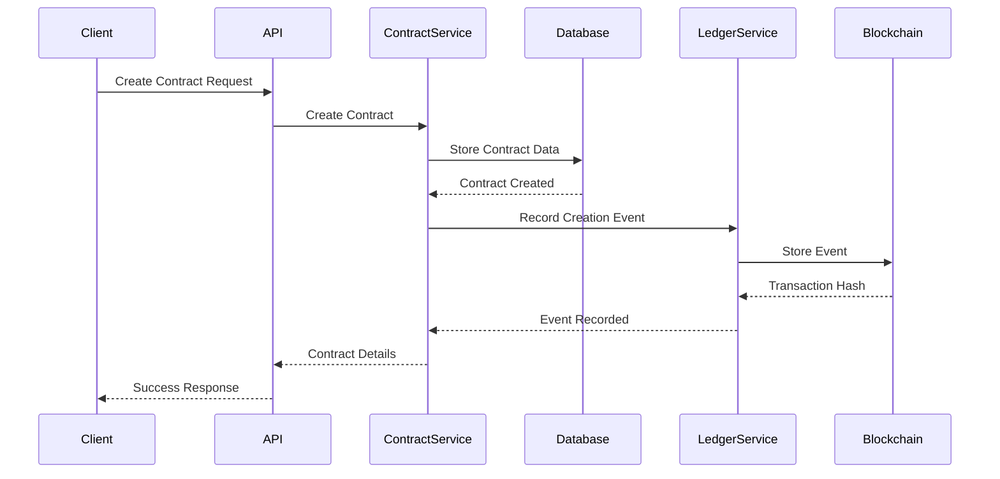
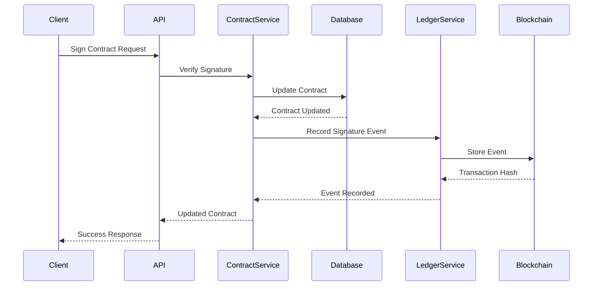
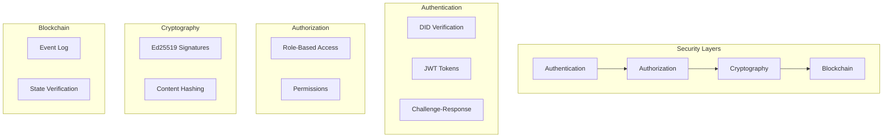
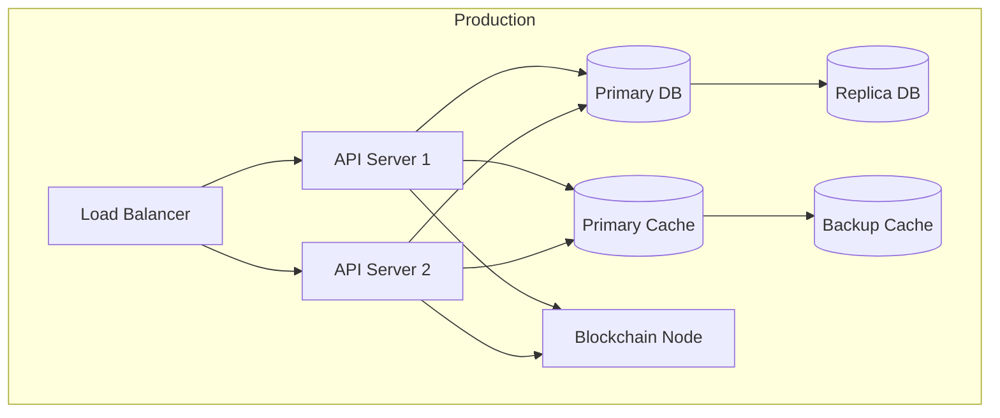

# Contract Management System Architecture

## System Overview

The Contract Management System is a decentralized application that combines traditional database storage with blockchain-based immutable ledger for contract management. The system uses DIDs (Decentralized Identifiers) for authentication and digital signatures.

## Architecture Diagram



## Component Details

### 1. Client Layer
- **Web UI**: React-based frontend for user interactions
- **CLI Tool**: Command-line interface for automation and scripting

### 2. API Layer
- **API Gateway**: Main entry point for all client requests
- **Auth Service**: Handles DID-based authentication
- **Rate Limiter**: Prevents abuse and ensures fair usage

### 3. Service Layer
- **Contract Service**: Core business logic for contract management
- **User Service**: User and organization management
- **Audit Service**: Logging and audit trail management
- **Ledger Service**: Blockchain interaction and event recording

### 4. Storage Layer
- **PostgreSQL**: Primary data storage
- **Blockchain**: Immutable ledger for contract events
- **Redis Cache**: Performance optimization

## Data Flow Diagrams

### Contract Creation Flow



### Contract Signing Flow



## Blockchain Integration

### Smart Contract Structure

```solidity
contract ContractLedger {
    struct Event {
        string eventType;
        string data;
        uint256 timestamp;
    }

    mapping(string => Event[]) private contractEvents;
    mapping(string => string) private contractStates;
}
```

### Event Types
1. **CREATED**: Initial contract creation
2. **SIGNED**: Contract signature
3. **UPDATED**: Contract modifications
4. **VOIDED**: Contract voiding

### State Verification
The system maintains contract state integrity through:
1. Content hashing
2. Blockchain event verification
3. Dual-storage validation

## Security Architecture



## API Documentation

See `openapi.yaml` for detailed API specifications.

## Error Handling

The system implements a comprehensive error handling strategy:

```rust
pub enum AppError {
    DatabaseError(DbErr),
    AuthError(String),
    ValidationError(String),
    NotFound(String),
    BlockchainError(String),
    ContractStateError(String),
    SignatureError(String),
    InternalError(String),
}
```

## Monitoring and Metrics

### Key Metrics
1. Contract Operations
2. Blockchain Events
3. Signature Verifications
4. API Response Times
5. Error Rates

### Health Checks
1. Database Connectivity
2. Blockchain Node Status
3. Cache Availability
4. API Endpoints

## Deployment Architecture



## Configuration

Environment variables and configuration files are documented in `.env.example` and `config/`.

## Development Setup

See `README.md` for development environment setup instructions. 