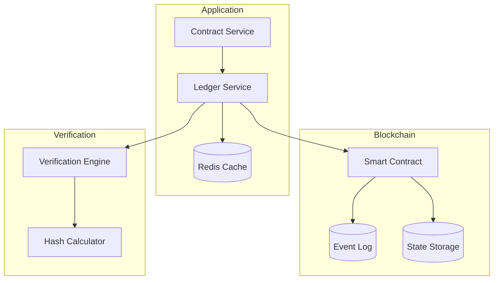
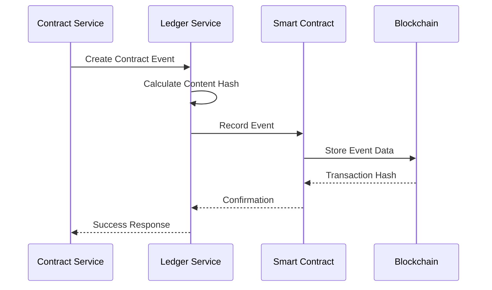
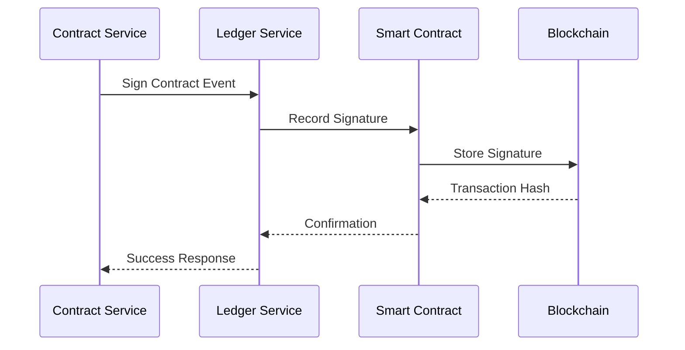
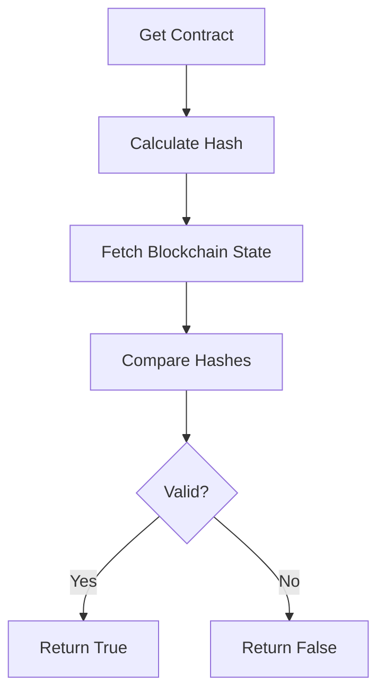

# Blockchain Integration Guide

## Overview

The Contract Management System uses blockchain technology to provide an immutable audit trail of contract events and ensure the integrity of contract states. This document details the blockchain integration architecture and implementation.

## Architecture



## Components

### 1. Ledger Service

The `LedgerService` acts as a bridge between the application and blockchain:

```rust
pub struct LedgerService {
    provider: Arc<Provider<Http>>,
    contract: ContractLedger<Provider<Http>>,
    wallet: LocalWallet,
}
```

Key responsibilities:
- Contract event recording
- State verification
- Event retrieval
- Content hashing

### 2. Smart Contract

The `ContractLedger` smart contract manages on-chain data:

```solidity
contract ContractLedger {
    struct Event {
        string eventType;
        string data;
        uint256 timestamp;
    }

    mapping(string => Event[]) private contractEvents;
    mapping(string => string) private contractStates;
}
```

Features:
- Event recording
- State management
- Event querying
- State verification

## Event Types

### 1. Contract Creation
```json
{
    "type": "CREATED",
    "data": {
        "contract_id": "uuid",
        "provider_did": "did:example:provider",
        "consumer_did": "did:example:consumer",
        "content_hash": "0x..."
    }
}
```

### 2. Contract Signature
```json
{
    "type": "SIGNED",
    "data": {
        "contract_id": "uuid",
        "signer_did": "did:example:signer",
        "signature": "base58_encoded_signature",
        "timestamp": 1234567890
    }
}
```

### 3. Contract Update
```json
{
    "type": "UPDATED",
    "data": {
        "contract_id": "uuid",
        "content_hash": "0x...",
        "updater_did": "did:example:updater"
    }
}
```

### 4. Contract Voiding
```json
{
    "type": "VOIDED",
    "data": {
        "contract_id": "uuid",
        "reason": "Cancellation requested",
        "voider_did": "did:example:voider"
    }
}
```

## Integration Flow

### 1. Contract Creation



### 2. Signature Recording



## State Verification

### Process Flow



### Implementation

```rust
async fn verify_contract_state(
    contract_id: Uuid,
    expected_hash: &str,
) -> Result<bool, AppError> {
    // Fetch blockchain state
    let state = contract.verify_contract_state(
        contract_id.to_string(),
        expected_hash.to_string()
    ).await?;

    Ok(state)
}
```

## Error Handling

### Blockchain Errors
```rust
pub enum AppError {
    BlockchainError(String),
    ContractStateError(String),
    // ... other errors
}
```

### Error Recovery
1. Transaction retry mechanism
2. Event queue for failed transactions
3. State reconciliation process

## Performance Considerations

### 1. Caching
- Cache blockchain responses
- Cache content hashes
- Cache verification results

### 2. Batch Processing
- Group multiple events
- Optimize gas usage
- Reduce network calls

### 3. Monitoring
- Transaction success rate
- Gas usage
- Response times
- Error rates

## Security

### 1. Key Management
- Secure private key storage
- Key rotation policy
- Access control

### 2. Transaction Security
- Gas limits
- Value validation
- Input sanitization

### 3. State Protection
- Access control
- State validation
- Hash verification

## Development Setup

### 1. Local Environment
```bash
# Start local blockchain
ganache-cli

# Deploy smart contract
truffle migrate

# Set environment variables
export BLOCKCHAIN_RPC_URL="http://localhost:8545"
export CONTRACT_ADDRESS="0x..."
export PRIVATE_KEY="0x..."
```

### 2. Testing
```bash
# Run blockchain tests
cargo test blockchain_integration

# Run contract tests
truffle test
```

## Production Deployment

### 1. Requirements
- Ethereum node access
- Deployed smart contract
- Secure key management
- Monitoring setup

### 2. Configuration
```toml
[blockchain]
rpc_url = "https://mainnet.infura.io/v3/..."
contract_address = "0x..."
chain_id = 1
gas_limit = 200000
```

### 3. Monitoring
- Transaction status
- Gas usage
- Event counts
- Error rates

## Troubleshooting

### Common Issues
1. Transaction failures
2. Gas estimation errors
3. State inconsistencies
4. Network issues

### Resolution Steps
1. Check network status
2. Verify gas settings
3. Validate contract state
4. Review event logs

## Future Improvements

1. Multi-chain support
2. Layer 2 scaling
3. Enhanced caching
4. Automated reconciliation
5. Advanced monitoring 