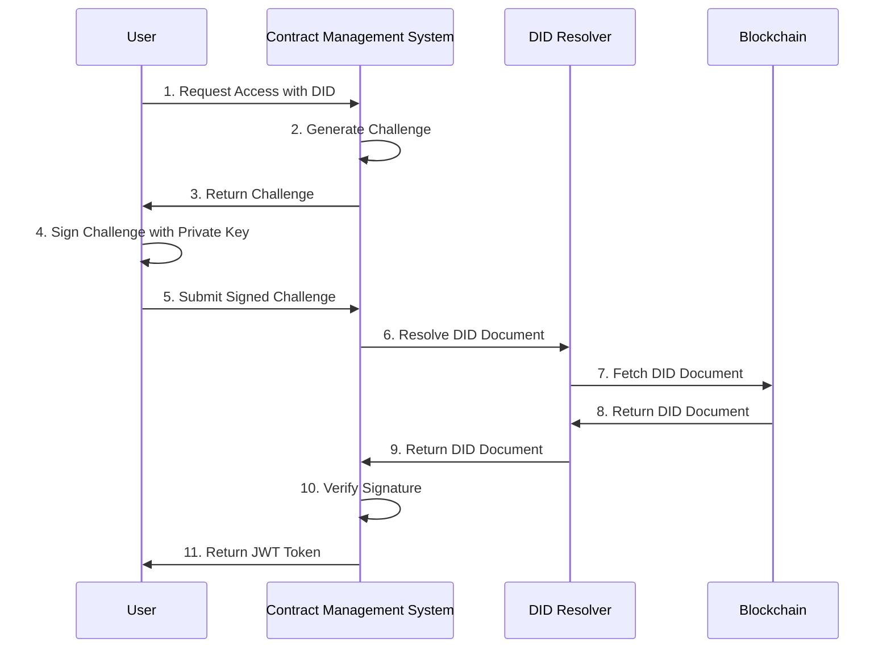

# Decentralized Identity (DID) Integration Guide

## Overview

This guide explains how to integrate Decentralized Identity (DID) authentication into the Contract Management System. DID provides a self-sovereign identity solution where users control their identities without relying on centralized authorities.

## Table of Contents
- [Architecture](#architecture)
- [Implementation Guide](#implementation-guide)
- [Security Considerations](#security-considerations)
- [Best Practices](#best-practices)
- [Example Implementations](#example-implementations)
- [Troubleshooting](#troubleshooting)

## Architecture

### Authentication Flow



### Component Structure

```
src/
├── auth/
│   ├── did/
│   │   ├── mod.rs
│   │   ├── challenge.rs
│   │   ├── resolver.rs
│   │   └── verification.rs
│   ├── middleware.rs
│   └── token.rs
```

## Implementation Guide

### 1. DID Challenge Generation

```rust
use uuid::Uuid;
use chrono::{DateTime, Utc};
use serde::{Serialize, Deserialize};

#[derive(Debug, Serialize, Deserialize)]
pub struct AuthChallenge {
    pub challenge_id: String,
    pub did: String,
    pub nonce: String,
    pub timestamp: DateTime<Utc>,
    pub expiration: DateTime<Utc>,
}

impl AuthChallenge {
    pub fn new(did: String) -> Self {
        let now = Utc::now();
        Self {
            challenge_id: Uuid::new_v4().to_string(),
            did,
            nonce: generate_secure_nonce(),
            timestamp: now,
            expiration: now + chrono::Duration::minutes(5),
        }
    }

    pub fn is_expired(&self) -> bool {
        Utc::now() > self.expiration
    }
}

fn generate_secure_nonce() -> String {
    use rand::RngCore;
    let mut rng = rand::thread_rng();
    let mut bytes = [0u8; 32];
    rng.fill_bytes(&mut bytes);
    hex::encode(bytes)
}
```

### 2. DID Resolution

```rust
use async_trait::async_trait;
use did_resolver::{DIDResolver, Document, Error};

#[async_trait]
pub trait DIDResolver {
    async fn resolve(&self, did: &str) -> Result<Document, Error>;
}

pub struct MultiResolver {
    resolvers: HashMap<String, Box<dyn DIDResolver>>,
}

impl MultiResolver {
    pub fn new() -> Self {
        let mut resolvers = HashMap::new();
        resolvers.insert("ethr".to_string(), Box::new(EthereumResolver::new()));
        resolvers.insert("web".to_string(), Box::new(WebResolver::new()));
        Self { resolvers }
    }

    pub async fn resolve(&self, did: &str) -> Result<Document, Error> {
        let method = did.split(':').nth(1).ok_or(Error::InvalidDID)?;
        let resolver = self.resolvers.get(method)
            .ok_or(Error::UnsupportedMethod)?;
        resolver.resolve(did).await
    }
}
```

### 3. Signature Verification

```rust
pub async fn verify_signature(
    challenge: &AuthChallenge,
    signature: &str,
    document: &Document,
) -> Result<bool, Error> {
    // 1. Check challenge expiration
    if challenge.is_expired() {
        return Err(Error::ChallengeExpired);
    }

    // 2. Get verification method from DID document
    let verification_method = document
        .verification_method
        .first()
        .ok_or(Error::NoVerificationMethod)?;

    // 3. Verify signature
    let message = serde_json::to_string(&challenge)?;
    match verification_method.type_.as_str() {
        "EcdsaSecp256k1VerificationKey2019" => {
            verify_secp256k1_signature(&message, signature, &verification_method.public_key_hex)
        }
        "Ed25519VerificationKey2018" => {
            verify_ed25519_signature(&message, signature, &verification_method.public_key_base58)
        }
        _ => Err(Error::UnsupportedVerificationMethod),
    }
}
```

### 4. Authentication Middleware

```rust
pub struct DIDAuthMiddleware {
    resolver: MultiResolver,
}

impl DIDAuthMiddleware {
    pub fn new() -> Self {
        Self {
            resolver: MultiResolver::new(),
        }
    }
}

#[async_trait]
impl<S> actix_web::dev::Transform<S, ServiceRequest> for DIDAuthMiddleware
where
    S: Service<ServiceRequest, Response = ServiceResponse, Error = Error>,
    S::Future: 'static,
{
    type Response = ServiceResponse;
    type Error = Error;
    type Transform = DIDAuthMiddlewareService<S>;
    type InitError = ();
    type Future = Ready<Result<Self::Transform, Self::InitError>>;

    fn new_transform(&self, service: S) -> Self::Future {
        ready(Ok(DIDAuthMiddlewareService {
            service,
            resolver: self.resolver.clone(),
        }))
    }
}
```

### 5. API Endpoints

```rust
#[post("/auth/challenge")]
async fn request_challenge(
    did: Json<String>,
    state: Data<AppState>,
) -> Result<Json<AuthChallenge>, Error> {
    let challenge = AuthChallenge::new(did.into_inner());
    state.store_challenge(&challenge).await?;
    Ok(Json(challenge))
}

#[post("/auth/verify")]
async fn verify_auth(
    auth: Json<AuthRequest>,
    state: Data<AppState>,
) -> Result<Json<AuthToken>, Error> {
    // 1. Retrieve challenge
    let challenge = state.get_challenge(&auth.challenge_id).await?;
    
    // 2. Resolve DID document
    let document = state.resolver.resolve(&challenge.did).await?;
    
    // 3. Verify signature
    if verify_signature(&challenge, &auth.signature, &document).await? {
        let token = generate_jwt_token(&challenge.did)?;
        Ok(Json(token))
    } else {
        Err(Error::InvalidSignature)
    }
}
```

## Security Considerations

### 1. Challenge Security
- Use cryptographically secure random numbers for nonces
- Implement short expiration times for challenges
- Store challenges securely (e.g., in Redis with expiration)
- Implement rate limiting for challenge requests

### 2. DID Document Verification
- Verify DID document freshness
- Implement caching with appropriate TTL
- Handle multiple verification methods
- Validate chain of trust for specific DID methods

### 3. Key Management
```rust
pub struct KeyRotationPolicy {
    pub max_key_age: Duration,
    pub required_backup_keys: u32,
    pub minimum_key_strength: u32,
}

pub async fn verify_key_compliance(
    document: &Document,
    policy: &KeyRotationPolicy,
) -> Result<bool, Error> {
    // Implementation details
}
```

## Best Practices

### 1. Multiple DID Method Support
- Implement support for popular DID methods:
  - did:ethr (Ethereum)
  - did:web (Web-based)
  - did:key (Cryptographic keys)
  - did:ion (Sidetree-based)

### 2. Error Handling
```rust
#[derive(Debug, thiserror::Error)]
pub enum DIDError {
    #[error("Invalid DID format")]
    InvalidDID,
    
    #[error("Challenge expired")]
    ChallengeExpired,
    
    #[error("Invalid signature")]
    InvalidSignature,
    
    #[error("DID resolution failed: {0}")]
    ResolutionFailed(String),
    
    #[error("Unsupported DID method")]
    UnsupportedMethod,
}
```

### 3. Logging and Monitoring
```rust
pub async fn log_auth_attempt(
    did: &str,
    success: bool,
    error: Option<&DIDError>,
) {
    tracing::info!(
        did = did,
        success = success,
        error = ?error,
        "DID authentication attempt"
    );
}
```

## Example Implementations

### 1. Ethereum DID Integration

```rust
pub struct EthereumResolver {
    provider: Provider<Http>,
}

impl EthereumResolver {
    pub fn new(rpc_url: &str) -> Self {
        Self {
            provider: Provider::<Http>::try_from(rpc_url)
                .expect("Failed to create Ethereum provider"),
        }
    }
}

#[async_trait]
impl DIDResolver for EthereumResolver {
    async fn resolve(&self, did: &str) -> Result<Document, Error> {
        // Implementation for Ethereum DID resolution
    }
}
```

### 2. Web DID Integration

```rust
pub struct WebResolver {
    client: Client,
}

impl WebResolver {
    pub fn new() -> Self {
        Self {
            client: Client::new(),
        }
    }
}

#[async_trait]
impl DIDResolver for WebResolver {
    async fn resolve(&self, did: &str) -> Result<Document, Error> {
        // Implementation for Web DID resolution
    }
}
```

## Troubleshooting

### Common Issues and Solutions

1. **Invalid Signature**
   - Verify the challenge format matches exactly
   - Check signature algorithm compatibility
   - Ensure correct public key format

2. **DID Resolution Failures**
   - Check network connectivity
   - Verify DID method support
   - Implement fallback resolvers

3. **Performance Issues**
   - Implement caching for DID documents
   - Use connection pooling for resolvers
   - Monitor resolution times

### Debugging Tools

```rust
pub struct DIDDebugger {
    pub challenge_store: Arc<RwLock<HashMap<String, AuthChallenge>>>,
    pub resolution_cache: Arc<RwLock<HashMap<String, (Document, Instant)>>>,
}

impl DIDDebugger {
    pub async fn debug_auth_flow(&self, did: &str) -> Result<DebugReport, Error> {
        let challenge = AuthChallenge::new(did.to_string());
        
        let mut report = DebugReport {
            did: did.to_string(),
            challenge: challenge.clone(),
            resolution_time: None,
            verification_time: None,
            cache_hits: 0,
            errors: Vec::new(),
        };

        // Test DID resolution
        let start = Instant::now();
        match self.resolve_did(did).await {
            Ok(doc) => {
                report.resolution_time = Some(start.elapsed());
                // Test signature verification
                let test_signature = "test_signature";
                let verify_start = Instant::now();
                match verify_signature(&challenge, test_signature, &doc).await {
                    Ok(_) => report.verification_time = Some(verify_start.elapsed()),
                    Err(e) => report.errors.push(format!("Verification error: {}", e)),
                }
            }
            Err(e) => report.errors.push(format!("Resolution error: {}", e)),
        }

        Ok(report)
    }

    pub async fn analyze_performance(&self) -> PerformanceReport {
        PerformanceReport {
            avg_resolution_time: self.calculate_avg_resolution_time().await,
            cache_hit_rate: self.calculate_cache_hit_rate().await,
            active_challenges: self.challenge_store.read().unwrap().len(),
            cached_documents: self.resolution_cache.read().unwrap().len(),
        }
    }
}

#[derive(Debug)]
pub struct DebugReport {
    pub did: String,
    pub challenge: AuthChallenge,
    pub resolution_time: Option<Duration>,
    pub verification_time: Option<Duration>,
    pub cache_hits: usize,
    pub errors: Vec<String>,
}

#[derive(Debug)]
pub struct PerformanceReport {
    pub avg_resolution_time: Duration,
    pub cache_hit_rate: f64,
    pub active_challenges: usize,
    pub cached_documents: usize,
}
```

## Implementation Details

### 1. Setting Up DID Authentication

```rust
// In main.rs or lib.rs
pub async fn configure_did_auth(config: &Config) -> DIDAuthConfig {
    let resolver = MultiResolver::new()
        .with_method("ethr", EthereumResolver::new(&config.ethereum_rpc_url))
        .with_method("web", WebResolver::new())
        .with_method("key", KeyResolver::new());

    let challenge_store = RedisStore::new(&config.redis_url).await?;
    
    DIDAuthConfig {
        resolver,
        challenge_store,
        jwt_secret: config.jwt_secret.clone(),
        challenge_timeout: Duration::from_secs(300),
    }
}

// In your application setup
let did_auth = configure_did_auth(&config).await?;
let app = App::new()
    .wrap(DIDAuthMiddleware::new(did_auth.clone()))
    .service(auth::did_routes());
```

### 2. Challenge Storage Implementation

```rust
pub struct RedisStore {
    client: redis::Client,
    prefix: String,
}

impl RedisStore {
    pub async fn store_challenge(&self, challenge: &AuthChallenge) -> Result<(), Error> {
        let key = format!("{}:challenge:{}", self.prefix, challenge.challenge_id);
        let value = serde_json::to_string(challenge)?;
        let expiry = challenge.expiration.timestamp() - Utc::now().timestamp();
        
        let mut conn = self.client.get_async_connection().await?;
        conn.set_ex(key, value, expiry as usize).await?;
        Ok(())
    }

    pub async fn get_challenge(&self, id: &str) -> Result<AuthChallenge, Error> {
        let key = format!("{}:challenge:{}", self.prefix, id);
        let mut conn = self.client.get_async_connection().await?;
        
        let value: String = conn.get(key).await?;
        let challenge: AuthChallenge = serde_json::from_str(&value)?;
        
        if challenge.is_expired() {
            return Err(Error::ChallengeExpired);
        }
        
        Ok(challenge)
    }
}
```

### 3. JWT Token Generation

```rust
pub struct JWTClaims {
    pub did: String,
    pub exp: i64,
    pub iat: i64,
    pub sub: String,
}

impl JWTClaims {
    pub fn new(did: &str) -> Self {
        let now = Utc::now();
        Self {
            did: did.to_string(),
            exp: (now + Duration::hours(24)).timestamp(),
            iat: now.timestamp(),
            sub: did.to_string(),
        }
    }
}

pub fn generate_jwt_token(did: &str, secret: &[u8]) -> Result<String, Error> {
    let claims = JWTClaims::new(did);
    let header = jsonwebtoken::Header::new(jsonwebtoken::Algorithm::HS256);
    
    jsonwebtoken::encode(&header, &claims, &jsonwebtoken::EncodingKey::from_secret(secret))
        .map_err(|e| Error::TokenGeneration(e.to_string()))
}
```

### 4. Rate Limiting Implementation

```rust
pub struct RateLimiter {
    store: Arc<RedisStore>,
    max_requests: u32,
    window_seconds: u32,
}

impl RateLimiter {
    pub async fn check_rate_limit(&self, did: &str) -> Result<bool, Error> {
        let key = format!("rate_limit:{}:{}", did, Utc::now().timestamp() / self.window_seconds as i64);
        let mut conn = self.store.client.get_async_connection().await?;
        
        let count: u32 = conn.incr(&key, 1).await?;
        if count == 1 {
            conn.expire(&key, self.window_seconds as usize).await?;
        }
        
        Ok(count <= self.max_requests)
    }
}
```

## Testing

### 1. Unit Tests

```rust
#[cfg(test)]
mod tests {
    use super::*;

    #[tokio::test]
    async fn test_challenge_generation() {
        let did = "did:example:123";
        let challenge = AuthChallenge::new(did.to_string());
        
        assert_eq!(challenge.did, did);
        assert!(!challenge.is_expired());
        assert!(challenge.nonce.len() >= 32);
    }

    #[tokio::test]
    async fn test_signature_verification() {
        let test_doc = create_test_document();
        let challenge = AuthChallenge::new("did:example:123".to_string());
        let signature = create_test_signature(&challenge);
        
        let result = verify_signature(&challenge, &signature, &test_doc).await;
        assert!(result.is_ok());
    }
}
```

### 2. Integration Tests

```rust
#[cfg(test)]
mod integration_tests {
    use super::*;
    use actix_web::test;

    #[actix_web::test]
    async fn test_auth_flow() {
        // Setup
        let app = test::init_service(
            App::new()
                .wrap(DIDAuthMiddleware::new(test_config()))
                .service(auth::did_routes())
        ).await;

        // Request challenge
        let req = test::TestRequest::post()
            .uri("/auth/challenge")
            .set_json(json!({"did": "did:example:123"}))
            .to_request();
        let resp: AuthChallenge = test::call_and_read_body_json(&app, req).await;
        
        // Verify challenge
        let signature = create_test_signature(&resp);
        let req = test::TestRequest::post()
            .uri("/auth/verify")
            .set_json(json!({
                "challenge_id": resp.challenge_id,
                "signature": signature,
            }))
            .to_request();
        let resp: AuthToken = test::call_and_read_body_json(&app, req).await;
        
        assert!(resp.token.len() > 0);
    }
}
```

## Deployment Considerations

1. **Scaling**
   - Use Redis cluster for challenge storage
   - Implement DID document caching
   - Consider multiple resolver instances

2. **Monitoring**
   - Track resolution times
   - Monitor cache hit rates
   - Alert on high error rates
   - Log authentication attempts

3. **Security**
   - Regular key rotation
   - Rate limiting
   - DDoS protection
   - Audit logging

## Future Improvements

1. **Enhanced Security**
   - Implement key rotation policies
   - Add support for selective disclosure
   - Implement credential verification

2. **Performance**
   - Optimize DID resolution
   - Implement batch operations
   - Add response caching

3. **Features**
   - Support more DID methods
   - Add credential management
   - Implement DID-based authorization 