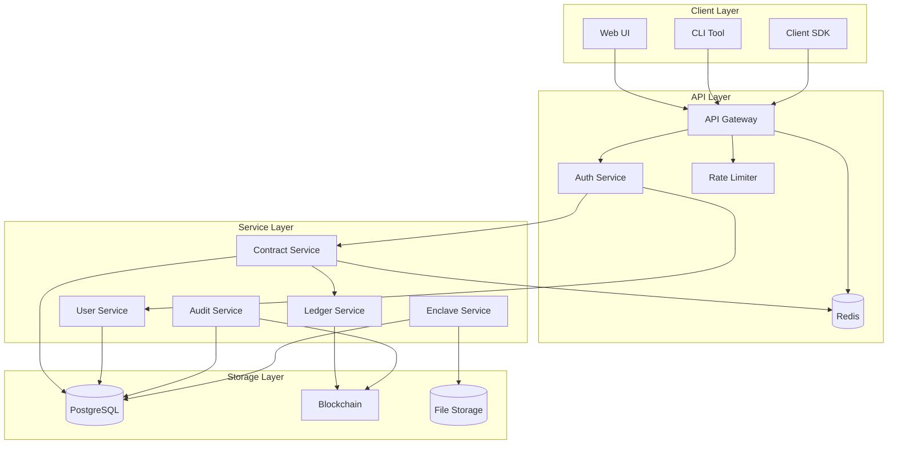
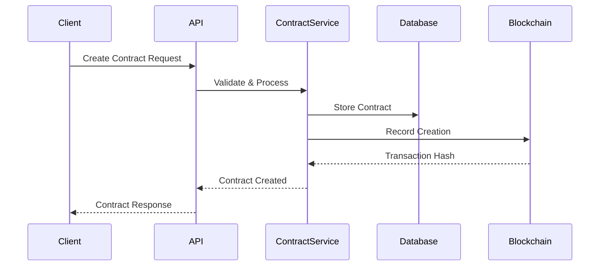
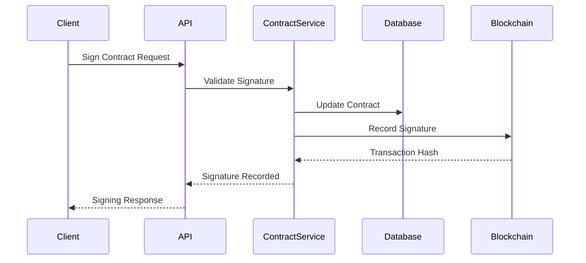
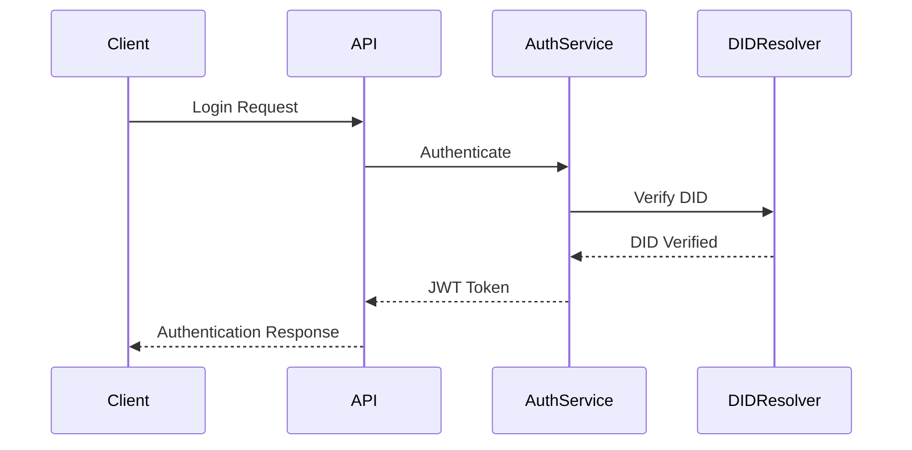
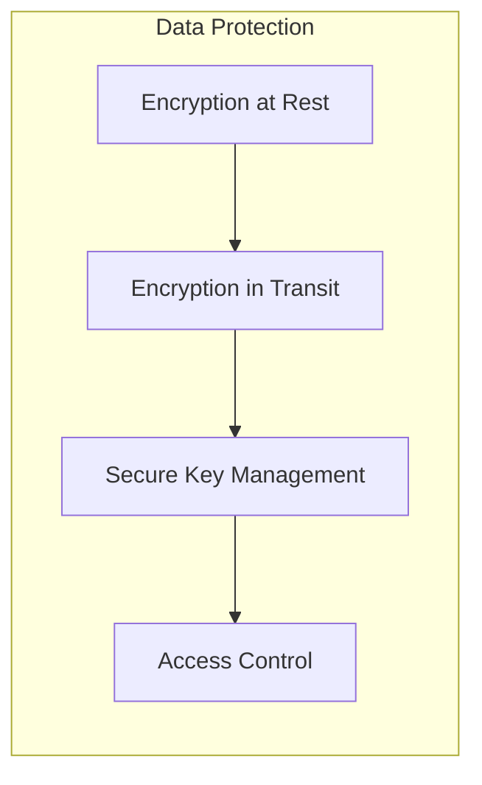
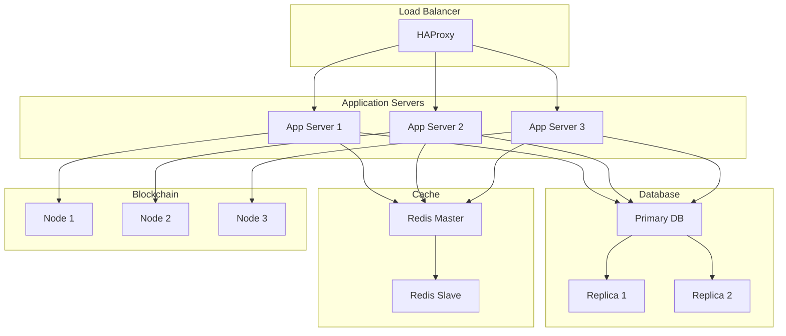
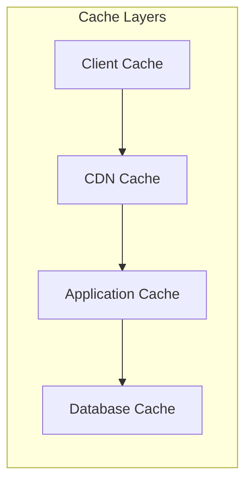
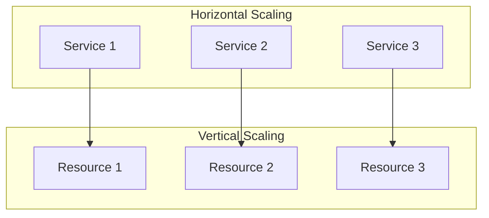

# Contract Management System Architecture

## System Overview

The Contract Management System is a distributed application that combines traditional database storage with blockchain-based immutable ledger for contract management. The system uses DIDs (Decentralized Identifiers) for authentication and digital signatures.

## High-Level Architecture

## Component Details

### 1. Client Layer

#### Web UI
- React-based frontend application
- Real-time contract status updates
- Digital signature interface
- Contract template management

#### CLI Tool
- Command-line interface for automation
- Scripting support
- Bulk operations
- System administration

#### Client SDK
- Language-specific client libraries
- API abstraction
- Error handling
- Authentication management

### 2. API Layer

#### API Gateway
- Request routing
- Load balancing
- SSL termination
- Request validation

#### Auth Service
- JWT token management
- DID verification
- Role-based access control
- Session management

#### Rate Limiter
- Request throttling
- IP-based limits
- User-based limits
- Burst protection

#### Cache Service
- Response caching
- Session storage
- Temporary data storage
- Performance optimization

### 3. Service Layer

#### Contract Service
- Contract lifecycle management
- Digital signature processing
- Contract validation
- State management

#### User Service
- User management
- Organization management
- Role management
- Permission management

#### Audit Service
- Event logging
- Audit trail generation
- Compliance reporting
- Security monitoring

#### Ledger Service
- Blockchain interaction
- Smart contract management
- Event recording
- State verification

#### Enclave Service
- Secure computation
- Data protection
- Attestation verification
- Resource management

### 4. Storage Layer

#### PostgreSQL
- Contract data
- User data
- Audit logs
- System configuration

#### Blockchain
- Immutable contract records
- Digital signatures
- State transitions
- Event history

#### Redis
- Session data
- Cache data
- Temporary storage
- Rate limiting data

#### File Storage
- Contract documents
- Attachments
- Templates
- Audit logs

## Data Flow

### Contract Creation Flow

### Contract Signing Flow

## Security Architecture

### Authentication Flow

### Data Protection

## Deployment Architecture

### Production Deployment

## Performance Considerations

### Caching Strategy

### Scaling Strategy

