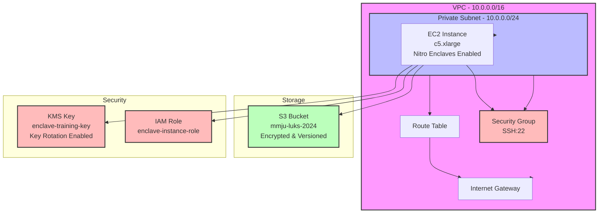

# AWS Nitro Enclaves Infrastructure

## Infrastructure Components

### Networking
- **VPC**: 10.0.0.0/16 with DNS support
- **Subnet**: Private subnet 10.0.0.0/24 in us-east-2a
- **Internet Gateway**: For internet access
- **Route Table**: Routes traffic through IGW
- **Security Group**: Allows SSH (port 22) access

### Compute
- **EC2 Instance**: c5.xlarge with Nitro Enclaves
  - 50GB GP3 root volume
  - User data script for Nitro Enclaves setup
  - Amazon Linux 2 AMI

### Storage
- **S3 Bucket**: mmju-luks-2024
  - Server-side encryption (AES-256)
  - Versioning enabled
  - Public access blocked
  - Used for training data storage

### Security
- **KMS Key**: enclave-training-key
  - Key rotation enabled
  - 7-day deletion window
  - IAM policies for EC2 access
- **IAM Role**: enclave-instance-role
  - EC2 instance profile
  - S3 access permissions
  - KMS encryption/decryption permissions

## Security Features
1. **Network Security**
   - Private subnet
   - Minimal security group rules
   - No public IP assignment

2. **Data Security**
   - S3 server-side encryption
   - KMS encryption for sensitive data
   - IAM roles with least privilege

3. **Instance Security**
   - Nitro Enclaves for secure processing
   - Encrypted root volume
   - Minimal IAM permissions 