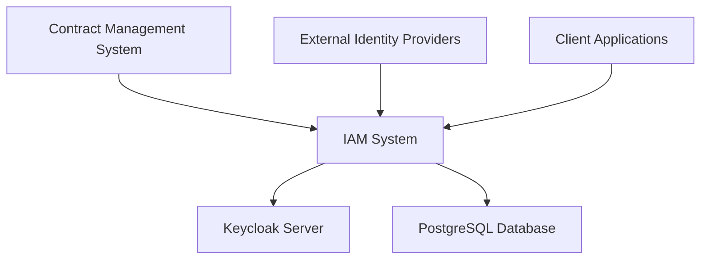
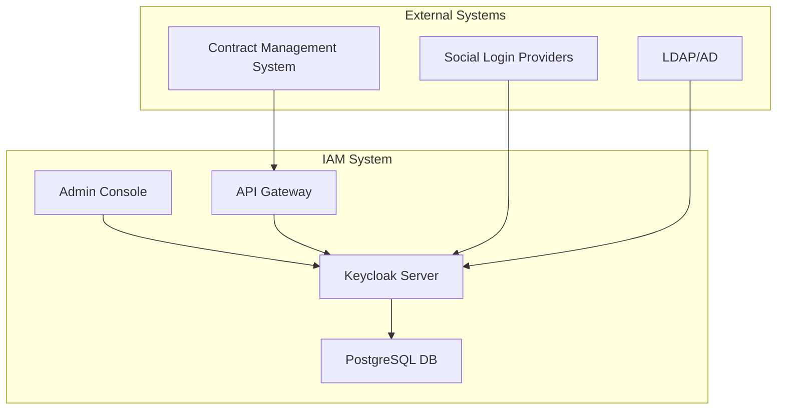
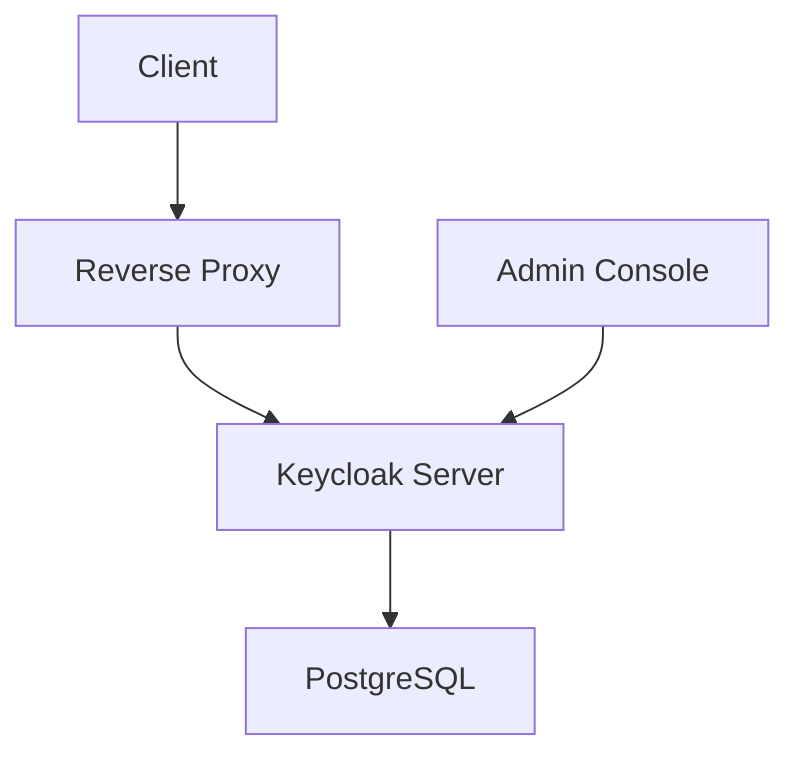
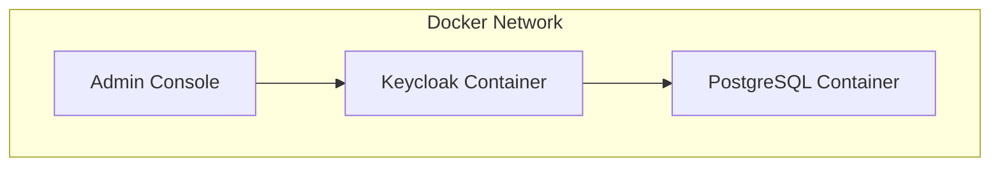
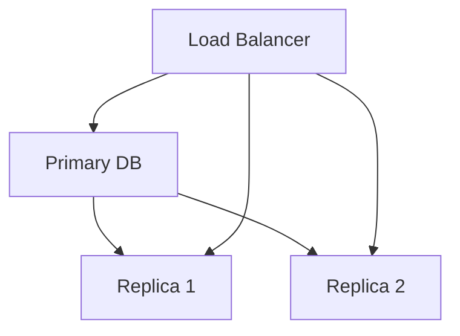
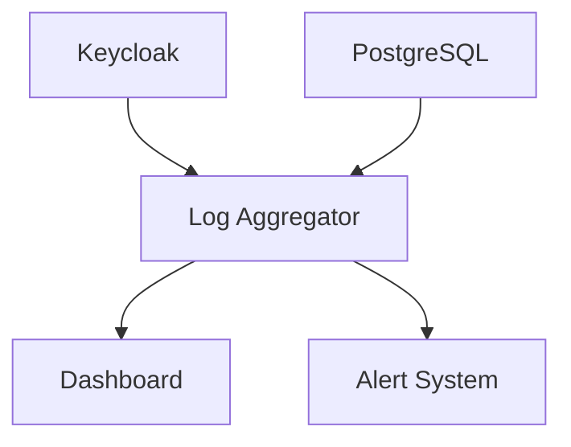

# Identity and Access Management (IAM) System Architecture Document

## 1. System Overview

### 1.1 Purpose
The IAM system provides secure authentication, authorization, and identity management for the Contract Management System using Keycloak as the core identity provider.

### 1.2 System Context


## 2. Architecture

### 2.1 High-Level Architecture


### 2.2 Component Architecture

#### 2.2.1 Keycloak Server
- **Container**: Docker
- **Version**: 22.0
- **Configuration**:
  - Development mode enabled
  - PostgreSQL database integration
  - Edge proxy configuration
  - Custom realm configuration

#### 2.2.2 Database Layer
- **Database**: PostgreSQL 15
- **Storage**: Docker volume
- **Schema**: Keycloak default schema
- **Backup**: Automated backup procedures

#### 2.2.3 Network Architecture


## 3. Deployment Architecture

### 3.1 Container Architecture


### 3.2 Environment Configuration
```yaml
# Environment Variables
KEYCLOAK_ADMIN: admin
KEYCLOAK_ADMIN_PASSWORD: admin
KC_DB: postgres
KC_DB_URL: jdbc:postgresql://postgres:5432/keycloak
KC_DB_USERNAME: keycloak
KC_DB_PASSWORD: keycloak
```

## 4. High Availability Design

### 4.1 Database Replication


### 4.2 Keycloak Clustering
- Multiple Keycloak instances
- Load balancing
- Session replication
- Cache synchronization

## 5. Monitoring and Logging

### 5.1 Monitoring Architecture


### 5.2 Logging Strategy
- Authentication logs
- Authorization logs
- Admin action logs
- System event logs
- Error logs

## 6. Security Architecture

### 6.1 Network Security
- TLS/SSL encryption
- Network segmentation
- Firewall rules
- Intrusion detection

### 6.2 Application Security
- Input validation
- Output encoding
- CSRF protection
- XSS prevention
- SQL injection prevention

## 7. Performance Architecture

### 7.1 Caching Strategy
- Token caching
- User session caching
- Permission caching
- Realm configuration caching

### 7.2 Scaling Strategy
- Horizontal scaling
- Load balancing
- Database sharding
- Cache distribution

## 8. Future Architecture

### 8.1 Planned Enhancements
- Kubernetes deployment
- Cloud-native architecture
- Microservices approach
- Service mesh integration

### 8.2 Scalability Roadmap
- Multi-region deployment
- Global load balancing
- Distributed caching
- Event-driven architecture 