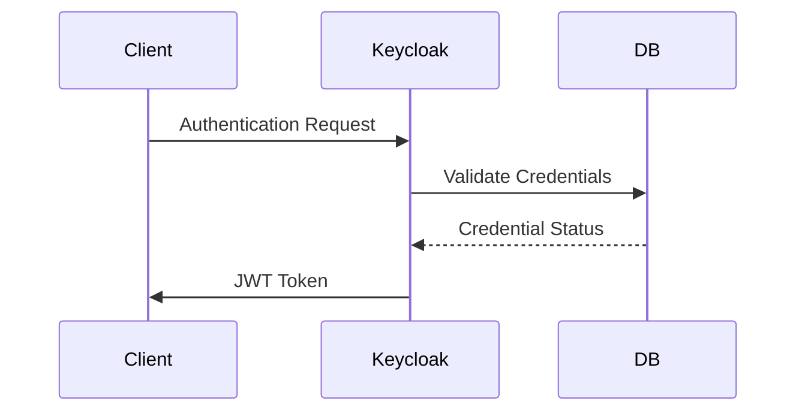
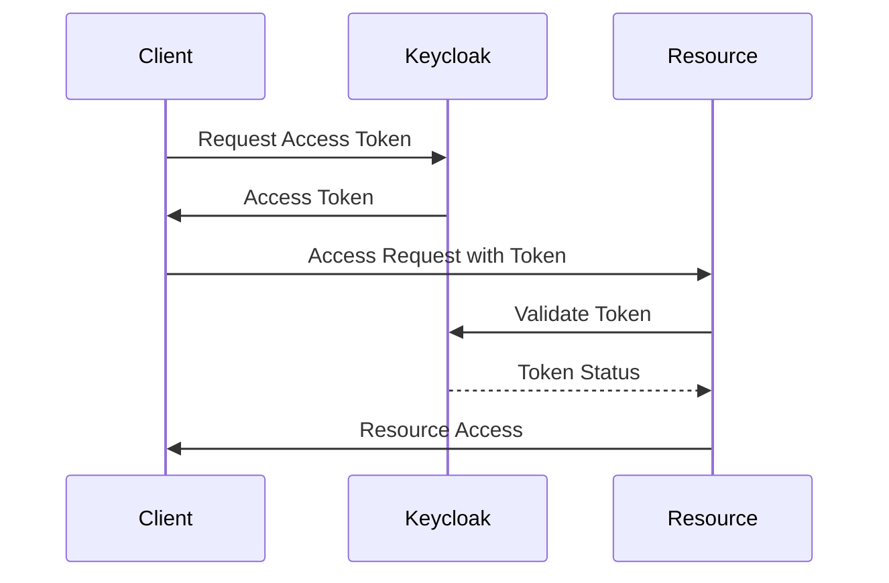
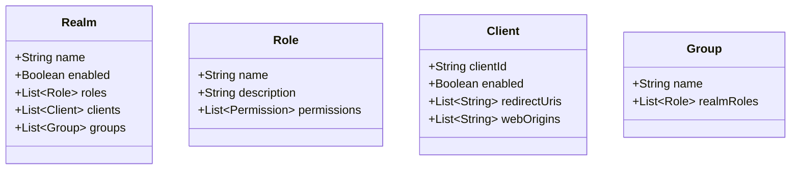
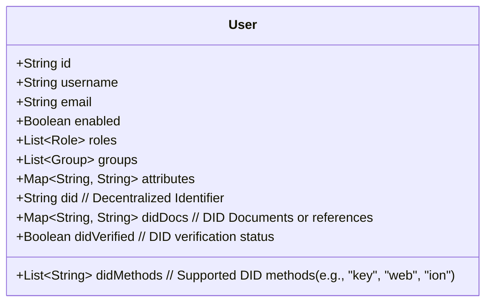
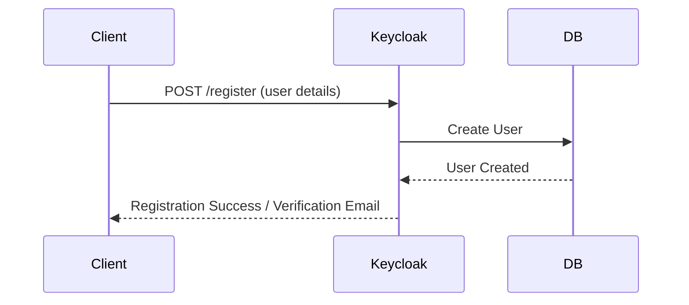
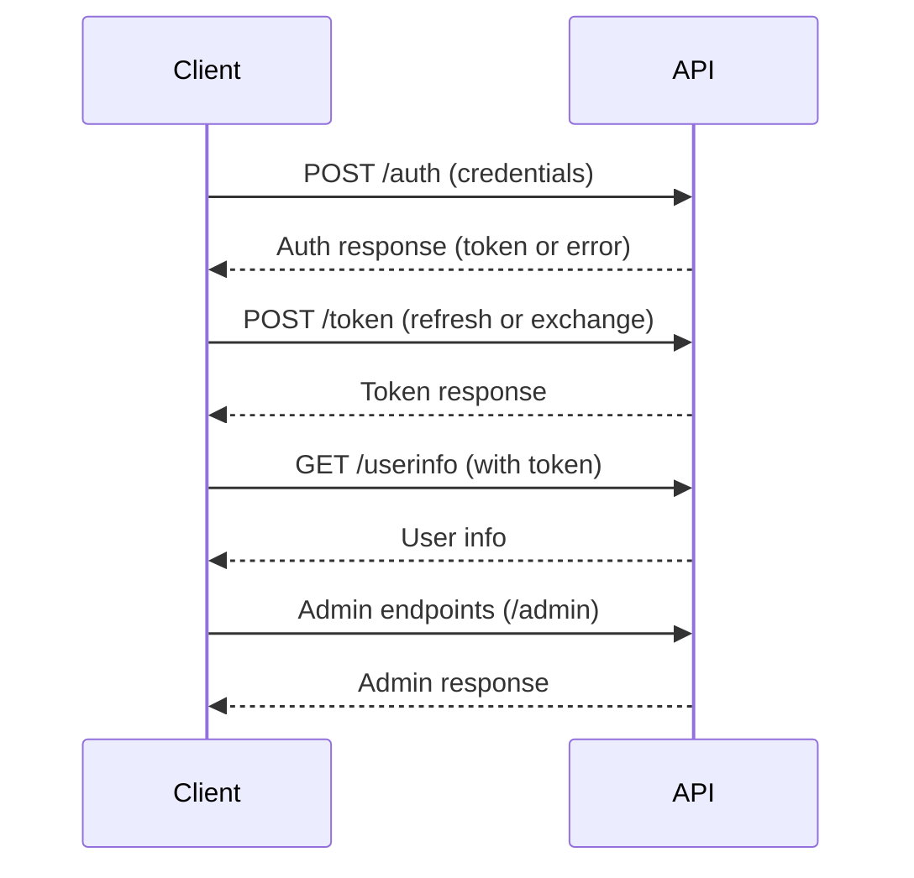
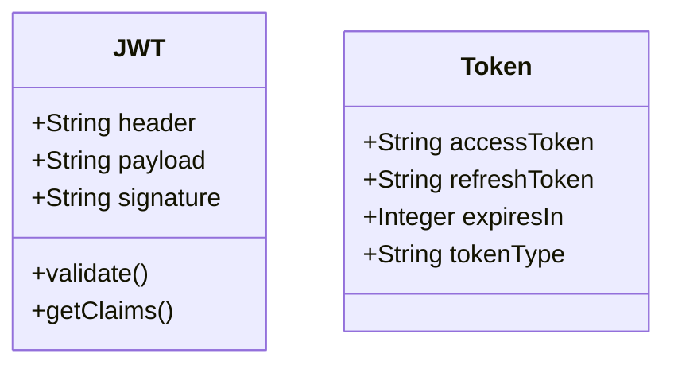
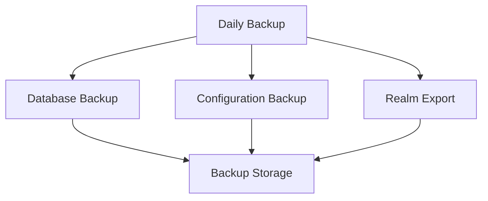
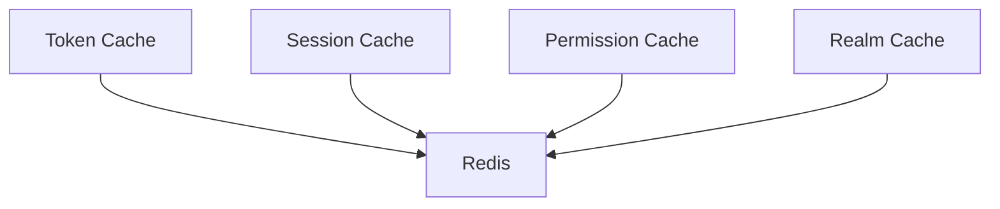

# Identity and Access Management (IAM) System Design Document

## 1. Authentication Design

### 1.1 Authentication Flow

This sequence diagram illustrates the authentication process using Keycloak as the identity provider. The client sends an authentication request (such as username and password) to Keycloak. Keycloak validates the credentials against the database. If valid, Keycloak issues a JWT token to the client for subsequent requests.

[Keycloak Authentication Flows](https://www.keycloak.org/docs/latest/server_admin/#authentication-flows) | [JWT Introduction](https://jwt.io/introduction/)

### 1.2 Authentication Methods

- Username/Password
- OAuth 2.0
- OpenID Connect
- Social Login (configurable)
- LDAP (configurable)

## 2. Authorization Design

### 2.1 Authorization Flow

This sequence diagram shows how authorization is handled. The client requests an access token from Keycloak. After receiving the token, the client uses it to access a protected resource. The resource server validates the token with Keycloak before granting access.

[OAuth 2.0 Authorization Framework](https://datatracker.ietf.org/doc/html/rfc6749) | [Keycloak Authorization Services](https://www.keycloak.org/docs/latest/authorization_services/)

### 2.2 Authorization Models

- Role-Based Access Control (RBAC)
- Group-Based Permissions
- Fine-Grained Access Control
- Token-Based Authorization

## 3. Data Model Design

### 3.1 Realm Structure

This class diagram represents the structure of a Keycloak realm, which is a logical grouping of users, roles, clients, and groups. Realms allow for multi-tenancy and isolation of authentication and authorization data.

[Keycloak Realms](https://www.keycloak.org/docs/latest/server_admin/#realms) | [Keycloak Data Model](https://www.keycloak.org/docs/latest/server_development/#_model)

### 3.2 User Model

This class diagram details the user model, including attributes such as ID, username, email, enabled status, roles, groups, custom attributes, and support for Decentralized Identifiers (DIDs). The addition of DID-related fields allows the system to integrate with decentralized identity frameworks, enabling users to be identified and verified using standards-based, self-sovereign identities.

[Keycloak User Storage](https://www.keycloak.org/docs/latest/server_development/#_user-storage-spi) | [User Federation](https://www.keycloak.org/docs/latest/server_admin/#user-federation) | [Decentralized Identifiers (DIDs) W3C Spec](https://www.w3.org/TR/did-core/)

**DID-related attributes:**
- **did:** The user's Decentralized Identifier (DID), e.g., `did:ion:xyz...`
- **didMethods:** List of DID methods supported or used by the user (e.g., `key`, `web`, `ion`).
- **didDocs:** Map containing DID Documents or references to their storage locations.
- **didVerified:** Boolean indicating whether the user's DID has been verified.

These attributes enable the IAM system to support decentralized identity use cases, such as self-sovereign identity, verifiable credentials, and interoperability with blockchain-based identity systems.

### 3.3 User Registration and Management

This section describes how users are registered and managed in Keycloak.

#### 3.3.1 User Registration Flow

This sequence diagram illustrates the process of registering a new user in the system. The client submits registration details to the Keycloak registration endpoint. Keycloak validates the input, creates the user in its database, and may trigger additional actions such as sending a verification email.

[Keycloak User Registration](https://www.keycloak.org/docs/latest/server_admin/#user-registration) | [Keycloak REST API: Create User](https://www.keycloak.org/docs-api/21.1.1/rest-api/index.html#_users_resource)

#### 3.3.2 User Management Operations

Keycloak provides a comprehensive set of user management features, including:

- **Create User:** Admins or self-service registration can create new users.
- **Update User:** Modify user attributes, roles, groups, or credentials.
- **Delete User:** Remove users from the system.
- **Enable/Disable User:** Temporarily deactivate or reactivate user accounts.
- **Assign Roles/Groups:** Manage user permissions and group memberships.
- **Password Reset:** Initiate password reset flows for users.
- **Email Verification:** Send and manage email verification for new users.

These operations can be performed via the Keycloak Admin Console or programmatically using the [Keycloak Admin REST API](https://www.keycloak.org/docs-api/21.1.1/rest-api/index.html#_users_resource).

**References:**
- [Keycloak User Management](https://www.keycloak.org/docs/latest/server_admin/#user-management)
- [Keycloak Admin REST API: Users](https://www.keycloak.org/docs-api/21.1.1/rest-api/index.html#_users_resource)

## 4. Integration Design

### 4.1 API Design

This sequence diagram outlines the main API endpoints and their interactions with the client. The client authenticates, refreshes tokens, retrieves user info, and accesses admin endpoints. Each interaction is shown as a request-response pair.

[Keycloak REST API](https://www.keycloak.org/docs-api/21.1.1/rest-api/index.html) | [OpenID Connect Discovery](https://openid.net/specs/openid-connect-discovery-1_0.html)

### 4.2 Protocol Support

- OAuth 2.0
- OpenID Connect
- SAML 2.0
- LDAP

## 5. Security Design

### 5.1 Token Design

This class diagram shows the structure of tokens used in the system. JWT tokens consist of a header, payload, and signature, and provide methods for validation and claim retrieval. The Token class represents access and refresh tokens, their expiry, and type.

[JSON Web Token (JWT) Specification](https://datatracker.ietf.org/doc/html/rfc7519) | [Keycloak Token Types](https://www.keycloak.org/docs/latest/server_admin/#_tokens)

### 5.2 Security Features

- Password Policies
- Brute Force Protection
- Session Management
- Audit Logging
- Token Validation

## 6. Backup and Recovery Design

### 6.1 Backup Strategy

This flowchart demonstrates the backup strategy, including daily backups of the database, configuration, and realm exports, all stored in a backup storage location. This ensures disaster recovery and data integrity.

[Keycloak Backup and Restore](https://www.keycloak.org/docs/latest/server_admin/#_backup_restore) | [Database Backup Best Practices](https://www.postgresql.org/docs/current/backup.html)

### 6.2 Recovery Procedures

- Database Restoration
- Configuration Restoration
- Realm Import
- Service Recovery

## 7. Performance Design

### 7.1 Caching Design

This flowchart shows the caching strategy, where different types of caches (token, session, permission, realm) are stored in Redis. This improves performance and scalability by reducing database load.

[Keycloak Caching](https://www.keycloak.org/docs/latest/server_installation/#cache) | [Redis Documentation](https://redis.io/docs/)

### 7.2 Scaling Design

- Horizontal Scaling
- Load Balancing
- Database Sharding
- Cache Distribution

## 8. Future Design Considerations

### 8.1 Planned Features

- Multi-Factor Authentication
- Social Login Integration
- Custom Authentication Flows
- Advanced Authorization Policies
- Audit Logging Enhancements

### 8.2 Design Improvements

- Microservices Architecture
- Event-Driven Design
- API Gateway Integration
- Service Mesh Implementation
