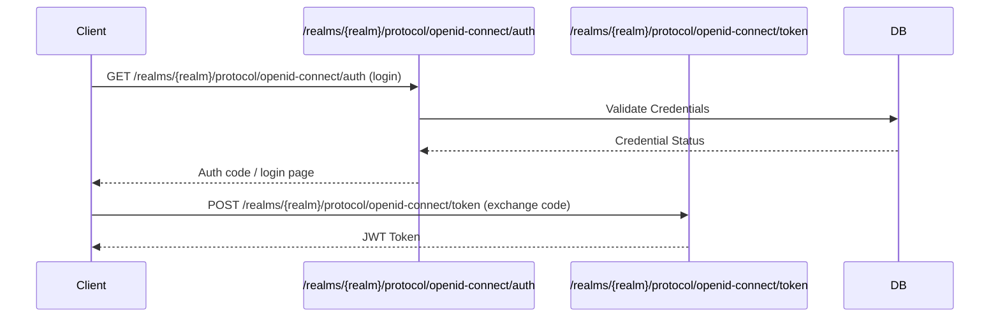
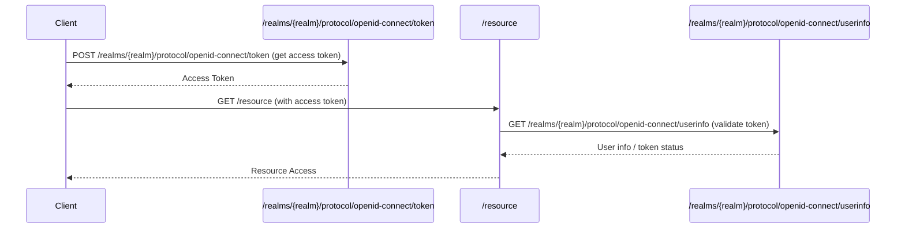
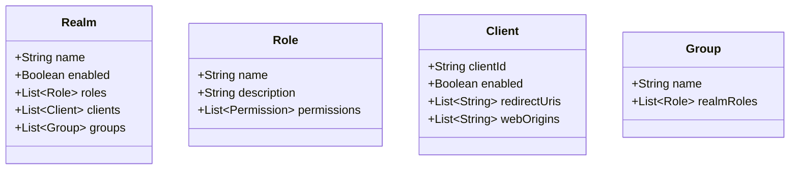
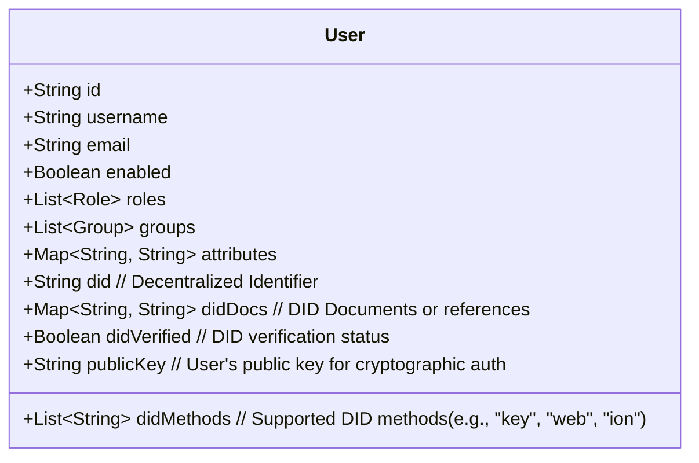
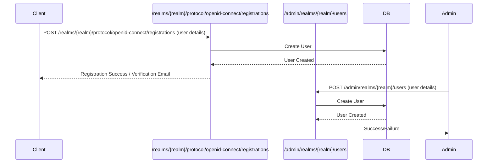
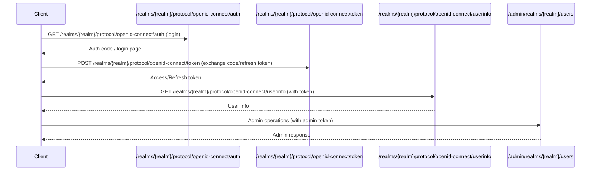
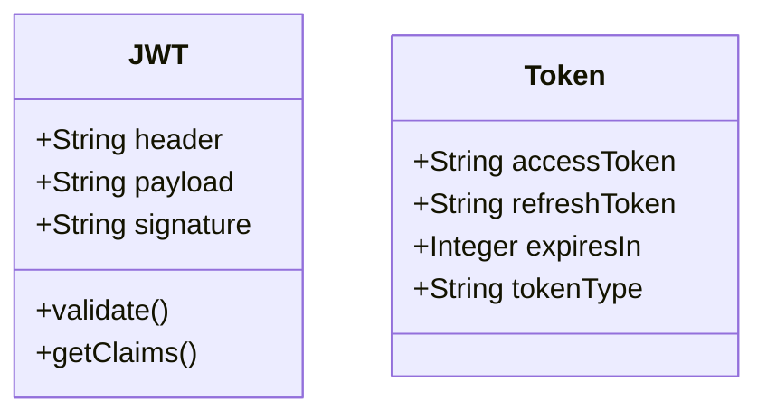
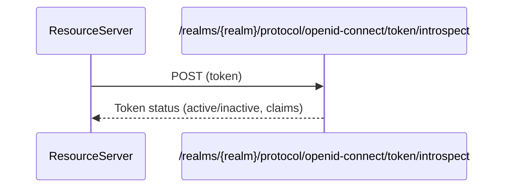
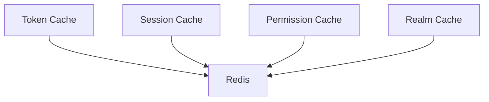

# Identity and Access Management (IAM) System Design Document

## 1. Authentication Design

### 1.1 Authentication Flow

This sequence diagram illustrates the authentication process using Keycloak as the identity provider, showing the actual endpoints involved. The client initiates authentication via the OpenID Connect authorization endpoint, receives an authorization code, and exchanges it for tokens at the token endpoint.

[Keycloak Authentication Flows](https://www.keycloak.org/docs/latest/server_admin/#authentication-flows) | [JWT Introduction](https://jwt.io/introduction/)



### 1.2 Authentication Methods

- Username/Password
- OAuth 2.0
- OpenID Connect
- Social Login (configurable)
- LDAP (configurable)

## 2. Authorization Design

### 2.1 Authorization Flow

This sequence diagram shows how authorization is handled using actual Keycloak endpoints. The client requests an access token from the token endpoint, uses it to access a protected resource, and the resource server validates the token (optionally using the userinfo endpoint).

[OAuth 2.0 Authorization Framework](https://datatracker.ietf.org/doc/html/rfc6749) | [Keycloak Authorization Services](https://www.keycloak.org/docs/latest/authorization_services/)



### 2.2 Authorization Models

- Role-Based Access Control (RBAC)
- Group-Based Permissions
- Fine-Grained Access Control
- Token-Based Authorization

## 3. Data Model Design

### 3.1 Realm Structure

This class diagram represents the structure of a Keycloak realm, which is a logical grouping of users, roles, clients, and groups. Realms allow for multi-tenancy and isolation of authentication and authorization data.

[Keycloak Realms](https://www.keycloak.org/docs/latest/server_admin/#realms) | [Keycloak Data Model](https://www.keycloak.org/docs/latest/server_development/#_model)



### 3.2 User Model

This class diagram details the user model, including attributes such as ID, username, email, enabled status, roles, groups, custom attributes, and support for Decentralized Identifiers (DIDs) and public keys. The addition of DID-related fields and public key storage allows the system to integrate with decentralized identity frameworks, passwordless authentication, and cryptographic login flows.

[Keycloak User Storage](https://www.keycloak.org/docs/latest/server_development/#_user-storage-spi) | [User Federation](https://www.keycloak.org/docs/latest/server_admin/#user-federation) | [Decentralized Identifiers (DIDs) W3C Spec](https://www.w3.org/TR/did-core/) | [Keycloak User Attributes](https://www.keycloak.org/docs/latest/server_admin/#user-attributes)



**DID- and Public Key-related attributes:**
- **did:** The user's Decentralized Identifier (DID), e.g., `did:ion:xyz...`
- **didMethods:** List of DID methods supported or used by the user (e.g., `key`, `web`, `ion`).
- **didDocs:** Map containing DID Documents or references to their storage locations.
- **didVerified:** Boolean indicating whether the user's DID has been verified.
- **publicKey:** The user's public key, used for cryptographic authentication (e.g., DID login, passwordless, WebAuthn).

These attributes enable the IAM system to support decentralized identity use cases, passwordless authentication, verifiable credentials, and interoperability with blockchain-based identity systems.

---

#### Storing and Retrieving a User's Public Key in Keycloak

You can store a user's public key as a custom attribute in Keycloak, either via the Admin Console or the REST API.

**Example: Storing a Public Key via REST API**

**Request:**
```http
PUT /admin/realms/{realm}/users/{user-id}
Content-Type: application/json
Authorization: Bearer {admin-token}

{
  "attributes": {
    "publicKey": "-----BEGIN PUBLIC KEY-----\nMIIBIjANBgkq...\n-----END PUBLIC KEY-----"
  }
}
```

**Retrieving the Public Key:**
- When you fetch the user via the Admin REST API (`GET /admin/realms/{realm}/users/{user-id}`), the `attributes.publicKey` field will contain the stored public key.

**Security Note:**  
- Public keys are not secrets and are safe to store and expose for verification.
- Never store private keys in Keycloak or any server-side system.

**References:**
- [Keycloak User Attributes](https://www.keycloak.org/docs/latest/server_admin/#user-attributes)
- [Keycloak Admin REST API: Users](https://www.keycloak.org/docs-api/21.1.1/rest-api/index.html#_users_resource)
- [W3C DID Core Spec: Public Keys](https://www.w3.org/TR/did-core/#verification-methods)

---

### 3.3 User Registration and Management

This section describes how users are registered and managed in Keycloak, using actual endpoints for both self-service and admin-driven registration.

#### 3.3.1 User Registration Flow

This sequence diagram illustrates the process of registering a new user in the system, showing both self-service registration (if enabled) and admin-driven registration.

[Keycloak User Registration](https://www.keycloak.org/docs/latest/server_admin/#user-registration) | [Keycloak REST API: Create User](https://www.keycloak.org/docs-api/21.1.1/rest-api/index.html#_users_resource)



#### 3.3.2 User Management Operations

Keycloak provides a comprehensive set of user management features, including:

- **Create User:**  
  - Admin: `POST /admin/realms/{realm}/users`
  - Self-service: `POST /realms/{realm}/protocol/openid-connect/registrations` (if enabled)
- **Update User:** `PUT /admin/realms/{realm}/users/{id}`
- **Delete User:** `DELETE /admin/realms/{realm}/users/{id}`
- **Enable/Disable User:** `PUT /admin/realms/{realm}/users/{id}`
- **Assign Roles/Groups:**  
  - Roles: `POST /admin/realms/{realm}/users/{id}/role-mappings/realm`
  - Groups: `PUT /admin/realms/{realm}/users/{id}/groups/{groupId}`
- **Password Reset:** `PUT /admin/realms/{realm}/users/{id}/reset-password`
- **Email Verification:** `PUT /admin/realms/{realm}/users/{id}/send-verify-email`

These operations can be performed via the Keycloak Admin Console or programmatically using the [Keycloak Admin REST API](https://www.keycloak.org/docs-api/21.1.1/rest-api/index.html#_users_resource).

**References:**
- [Keycloak User Management](https://www.keycloak.org/docs/latest/server_admin/#user-management)
- [Keycloak Admin REST API: Users](https://www.keycloak.org/docs-api/21.1.1/rest-api/index.html#_users_resource)

## 4. Integration Design

### 4.1 API Design

This sequence diagram outlines the main Keycloak REST API endpoints and their interactions with the client. The client authenticates, refreshes tokens, retrieves user info, and accesses admin endpoints. Each interaction is shown as a request-response pair with the actual Keycloak endpoint.

[Keycloak REST API](https://www.keycloak.org/docs-api/21.1.1/rest-api/index.html) | [OpenID Connect Discovery](https://openid.net/specs/openid-connect-discovery-1_0.html)

**Key Endpoints:**
- `/realms/{realm}/protocol/openid-connect/auth` — Authorization endpoint (user login)
- `/realms/{realm}/protocol/openid-connect/token` — Token endpoint (get/refresh tokens)
- `/realms/{realm}/protocol/openid-connect/userinfo` — User info endpoint
- `/admin/realms/{realm}/users` — Admin user management endpoint



### 4.2 Protocol Support

- OAuth 2.0
- OpenID Connect
- SAML 2.0
- LDAP

## 5. Security Design

### 5.1 Token Design

This class diagram shows the structure of tokens used in the system. JWT tokens consist of a header, payload, and signature, and provide methods for validation and claim retrieval. The Token class represents access and refresh tokens, their expiry, and type.

[JSON Web Token (JWT) Specification](https://datatracker.ietf.org/doc/html/rfc7519) | [Keycloak Token Types](https://www.keycloak.org/docs/latest/server_admin/#_tokens)



**Token Management Endpoints:**
- **Token Introspection:** `POST /realms/{realm}/protocol/openid-connect/token/introspect`
- **Token Revocation:** `POST /realms/{realm}/protocol/openid-connect/revoke`
- **Logout:** `POST /realms/{realm}/protocol/openid-connect/logout`

**Example Token Introspection Flow:**


### 5.2 Security Features

- Password Policies
- Brute Force Protection
- Session Management
- Audit Logging
- Token Validation

## 6. Backup and Recovery Design

### 6.1 Backup Strategy

This flowchart demonstrates the backup strategy, including daily backups of the database, configuration, and realm exports, all stored in a backup storage location. This ensures disaster recovery and data integrity.

[Keycloak Backup and Restore](https://www.keycloak.org/docs/latest/server_admin/#_backup_restore) | [Database Backup Best Practices](https://www.postgresql.org/docs/current/backup.html)

**Key Backup/Restore Endpoints and Commands:**
- **Export Realm (REST):** `POST /admin/realms/{realm}/partial-export`
- **Import Realm (REST):** `POST /admin/realms/{realm}/partial-import`
- **Export/Import (CLI):** `bin/kc.sh export` and `bin/kc.sh import`

```mermaid
graph TD
    A[Daily Backup] --> B[Database Backup]
    A --> C[Configuration Backup]
    A --> D[Realm Export: /admin/realms/{realm}/partial-export]
    B --> E[Backup Storage]
    C --> E
    D --> E
```

### 6.2 Recovery Procedures

- Database Restoration
- Configuration Restoration
- Realm Import (`/admin/realms/{realm}/partial-import` or `kc.sh import`)
- Service Recovery

## 7. Performance Design

### 7.1 Caching Design

This flowchart shows the caching strategy, where different types of caches (token, session, permission, realm) are stored in Redis. This improves performance and scalability by reducing database load.

[Keycloak Caching](https://www.keycloak.org/docs/latest/server_installation/#cache) | [Redis Documentation](https://redis.io/docs/)



### 7.2 Scaling Design

- Horizontal Scaling
- Load Balancing
- Database Sharding
- Cache Distribution

## 8. Future Design Considerations

### 8.1 Planned Features

- Multi-Factor Authentication
- Social Login Integration
- Custom Authentication Flows
- Advanced Authorization Policies
- Audit Logging Enhancements

### 8.2 Design Improvements

- Microservices Architecture
- Event-Driven Design
- API Gateway Integration
- Service Mesh Implementation
