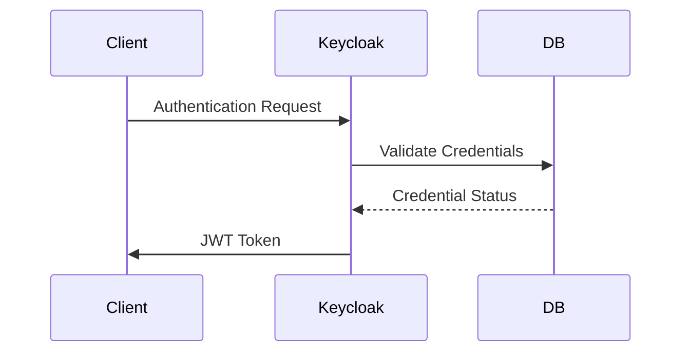
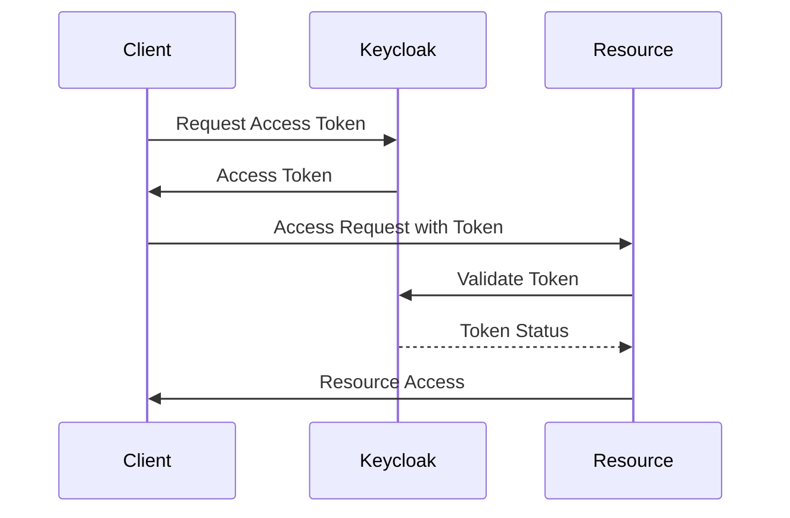
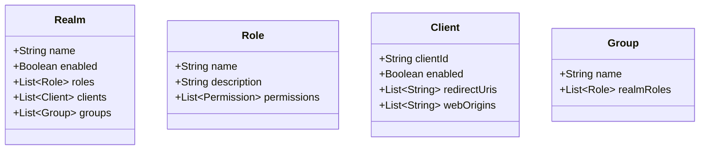
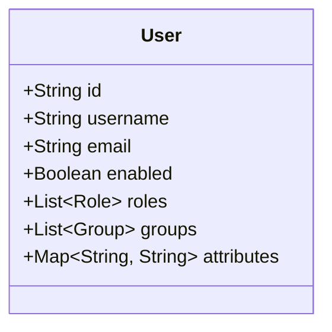
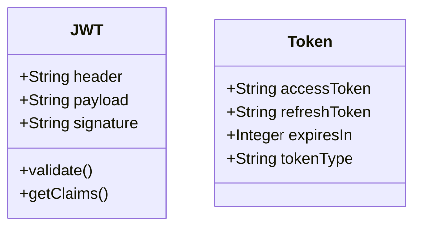
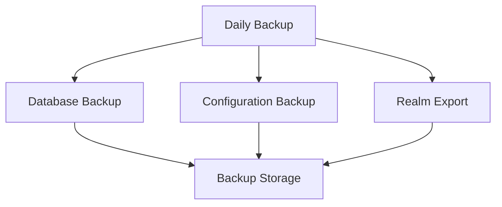
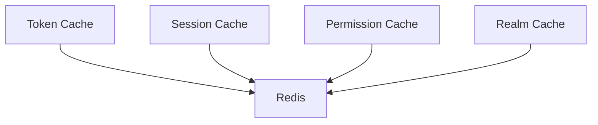

# Identity and Access Management (IAM) System Design Document

## 1. Authentication Design

### 1.1 Authentication Flow


### 1.2 Authentication Methods
- Username/Password
- OAuth 2.0
- OpenID Connect
- Social Login (configurable)
- LDAP (configurable)

## 2. Authorization Design

### 2.1 Authorization Flow


### 2.2 Authorization Models
- Role-Based Access Control (RBAC)
- Group-Based Permissions
- Fine-Grained Access Control
- Token-Based Authorization

## 3. Data Model Design

### 3.1 Realm Structure


### 3.2 User Model


## 4. Integration Design

### 4.1 API Design
```mermaid
graph LR
    A[Client] --> B[/auth]
    A --> C[/token]
    A --> D[/userinfo]
    A --> E[/admin]
```

### 4.2 Protocol Support
- OAuth 2.0
- OpenID Connect
- SAML 2.0
- LDAP

## 5. Security Design

### 5.1 Token Design


### 5.2 Security Features
- Password Policies
- Brute Force Protection
- Session Management
- Audit Logging
- Token Validation

## 6. Backup and Recovery Design

### 6.1 Backup Strategy


### 6.2 Recovery Procedures
- Database Restoration
- Configuration Restoration
- Realm Import
- Service Recovery

## 7. Performance Design

### 7.1 Caching Design


### 7.2 Scaling Design
- Horizontal Scaling
- Load Balancing
- Database Sharding
- Cache Distribution

## 8. Future Design Considerations

### 8.1 Planned Features
- Multi-Factor Authentication
- Social Login Integration
- Custom Authentication Flows
- Advanced Authorization Policies
- Audit Logging Enhancements

### 8.2 Design Improvements
- Microservices Architecture
- Event-Driven Design
- API Gateway Integration
- Service Mesh Implementation 